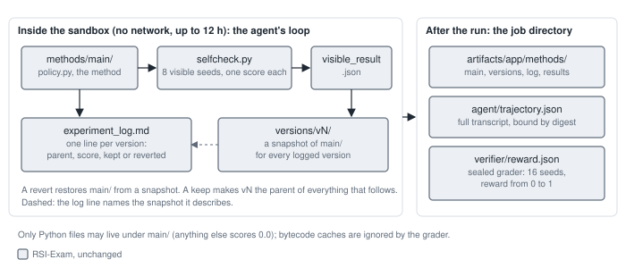
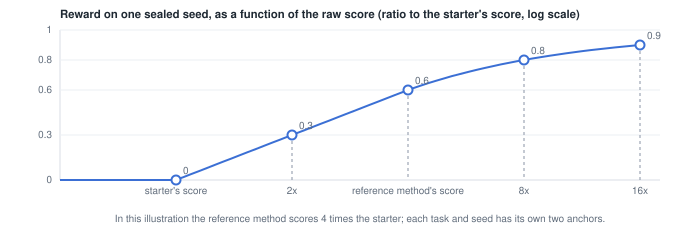
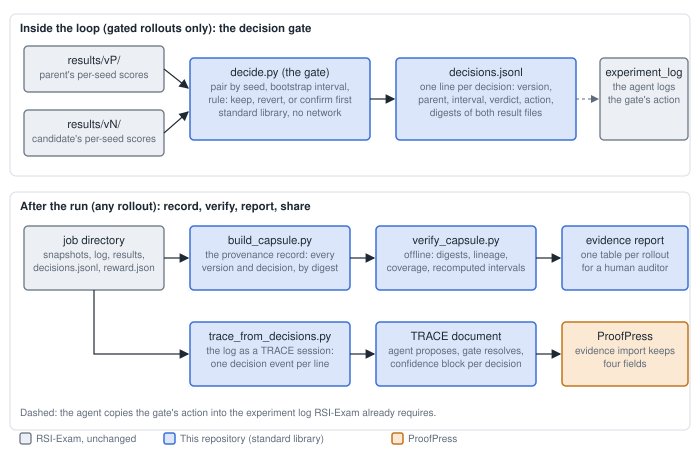
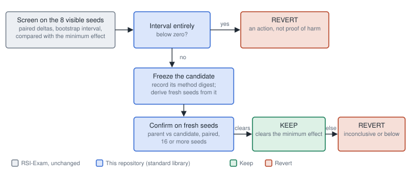
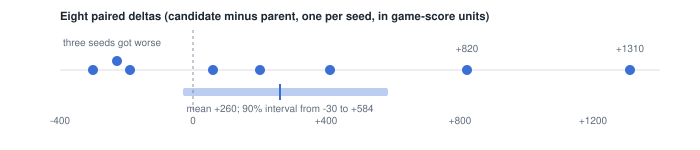

# Decision confidence for RSI-Exam rollouts: the exam, the gate, and the record

In one paragraph. RSI-Exam lets an AI agent improve a weak method for up to 12 hours, keeping a
log and a snapshot of every version, and then scores the final version on sealed seeds. Every
"keep this version" decision the agent makes rests on one visible number. This repository adds a
small, standard-library decision gate that turns each keep-or-revert into a measured decision
with a confidence interval, records it in an append-only log, converts that log into a TRACE
decision record, and binds it into an offline-verifiable provenance record of the rollout.
ProofPress imports the TRACE record as evidence. Nothing in RSI-Exam's harness, prompt, or grader
changes for official runs.

Each section ends with a plain-terms analogy for readers who want the shape of the idea before
the mechanism.

## 1. RSI-Exam, in the detail that matters here

### What it is

A public benchmark (released 2026-08-29, MIT licence, 35 public tasks on Hugging Face with their
grading containers) that asks one question: can an agent take a working but weak method for a
real scientific or production problem and make it stronger, on its own, without seeing the
held-out evaluation? Each task supplies a starter method, a visible development split, a
self-check script, and a sealed grader. The agent's job is the loop below; the final method is
what gets scored.

*In plain terms.* A student is given a practice test with the answer key and told to get better
at the subject. The final exam uses different questions from the same syllabus, and the student
never sees it. The practice test is the visible split; the final exam is the sealed split.

### The rollout protocol the agent must follow

1. Work in `/app/methods/main/`. Run experiments: form a hypothesis, build it, measure it with
   the task's own self-check on the visible split.
2. After each experiment, append one line to `/app/methods/experiment_log.md`: version id,
   parent id, what changed, the score(s) measured, and kept or reverted.
3. Snapshot every logged version, kept or reverted, to `/app/methods/versions/v<N>` (a copy of
   `main/`), and never delete one. To revert, restore `main/` from a snapshot; that adds no new
   snapshot.
4. Decide early, and note in the log, how generalization will be judged. The program suggests
   a hold-out slice, cross-validation, repeats, or checks across slices, and leaves the choice
   to the agent.

The sandbox has no network and a 12-hour limit. The grader copies `main/` into a clean
environment and runs it on hidden data.

*Figure 1. The rollout anatomy. The visible score is a proxy; the sealed reward is what counts,
and the agent never sees it during the run.*

*In plain terms.* The log and the snapshots are a climber's journal and cairns: every step is
written down and marked so that anyone can retrace the route afterwards. A revert is walking
back to an earlier cairn. A keep is deciding to continue from this one.

### The numbers: raw score, reward, and what 0, 0.6, and 1 mean

Three different kinds of number appear in RSI-Exam, and it helps to keep them apart.

- The **raw score** is the task's own metric in its own units. For 2048 it is the merge score of
  a game, typically in the thousands. The visible self-check reports raw scores, one per seed,
  and their mean.
- The **reward** is a number from 0 to 1 that the sealed grader computes for each sealed seed
  from the raw score, using two reference points fixed per seed when the task was built: the raw
  score the starter method gets on that seed, and the raw score a strong reference method gets.
  Matching the starter gives 0; matching the reference gives 0.6; halfway between them, on a
  ratio scale, gives 0.3; beating the reference earns more, with diminishing returns,
  approaching 1 but never reaching it; scoring below the starter gives 0. The rollout's reward is
  the average over the sealed seeds and is the number in `reward.json`.
- **Task-specific proxies** such as the README's example, where a visible number climbed from
  0.10 to 0.63 while the hidden number moved from 0.13 to 0.26, are that task's own 0-to-1 metric
  on its visible and hidden splits. The gap is the point: the visible number is a proxy and can
  drift far from the hidden one.

*Figure 2. How one sealed seed's raw score becomes its reward. The scale is logarithmic in the
raw score, so doubling from the starter to twice its score is worth the same as doubling again to
the reference. Illustrative anchors: the reference method scores four times the starter.*

*In plain terms.* Reward is grading on a curve between two reference students. The weak starter
sets the zero line. The strong reference method sets the 0.6 line. Beat the reference and you
climb toward 1, but each further doubling of the raw score earns less than the last.

### The task this work starts with: 2048 policy search

| Item | Detail |
| --- | --- |
| The method | A single Python file, `methods/main/policy.py`, defining `choose_move(board)`. Standard library only, deterministic for a given board, at most 10 MB, self-contained. |
| Visible split | Eight seeded games (seeds fixed in `visible_seeds.json`). `selfcheck.py` plays all eight and writes `/app/visible_result.json` with the mean raw score, the median, the maximum tile, CPU use, and one entry per seed with its score. |
| Sealed split | Sixteen seeded games with per-seed anchors, in the task's `tests/` directory. For public tasks that directory is published, so "hidden" is relative: the agent does not see it during the run, but it is available offline afterwards. |
| Metric | Raw: mean merge score over the suite, higher is better. Reward: the anchored per-seed mapping in Figure 2, averaged. Pairing by seed therefore mirrors the grader's own unit. |
| Limits enforced | 225 CPU-seconds per game, pooled across the suite; 5 seconds per move; a callback error, illegal move, or timeout ends that game; an oversized file scores zero. |
| Why first | CPU only, a few kilobytes of code, minutes per evaluation, and a per-seed result file the gate can read directly. |

### Two facts about the grader that shape the design

- **Only Python files may live under `main/`.** The grader stages the policy through a sandbox
  that rejects any other regular file and scores the submission 0.0. The task instruction tells
  agents to save results under `versions/vN/`, and the program's revert command copies a
  snapshot back into `main/`; an agent that follows both literally can zero its own submission.
  The rule here: result files never live inside a snapshot or `main/`.
- **Bytecode caches change bytes.** The self-check imports the policy and writes `__pycache__`
  into `main/`; copying a snapshot copies it; re-importing rewrites it. Any digest of "the
  method" must exclude caches, which is exactly what the grader does.

### How contributions and credit work

| Track | What it is | Credits |
| --- | --- | --- |
| Task author | Write a task from your own field (about 18 hours). | 15 (10 if they build it from your problem) |
| Reviewer | Review a task with a written verdict (about 4 hours). | 4 |
| Auditor | Read one agent trajectory end to end and say whether the score moved for a real reason (about 2 hours). | 2 |
| Advisor | Scoring, sealing, difficulty gates, the harness: "a pipeline or evaluation change we adopt". | 2 to 8 |

Paper authorship needs 15 credits confirmed by a window (1.0: September 15, 2026; 2.0:
December 15, 2026). Core contributors are ranked on contribution, independence, and reach. This
work is an advisor-track contribution.

## 2. The problem addressed

The auditor's question, "did the score move for a real reason?", is answered today by a person
reading twelve hours of logs. The reason it is hard is structural: each keep-or-revert rests on
one visible number over eight seeds, the same eight seeds are reused for every candidate across
the whole search, and a version kept on a lucky number becomes the parent of everything after
it. A false keep compounds; a true gain reverted wastes the budget the other way. Nothing in the
job directory records why a keep was made or how sure the measurement was.

*In plain terms.* Climbing a hill in fog with a hand-held altimeter that wobbles by a few metres.
Each time it reads higher you commit to the new spot and never go back. Some of those readings
were the wobble, not the hill. The sealed grader is the surveyor who measures your final position
with proper instruments.

*In plain terms, again.* Line up eight people and measure each with a tape that is off by up to a
foot in either direction. The one who measures tallest is partly tall and partly lucky. If you
keep re-measuring the same eight people, the luck does not go away; it becomes part of the
record. That is why the gate measures again on fresh seeds before it trusts a winner.

## 3. What this repository adds, component by component

Two layers. Inside the loop (gated rollouts only, recorded as modified-program runs because one
step is added to the program text): the gate. After the run (works on any rollout, official or
not): the provenance record, the verifier, the TRACE document, and the ProofPress import.

*Figure 3. The gate writes numbers and digests only (no prompts, transcripts, or reasoning). The
record binds each decision to the exact result files it rested on, so a later reader can
recompute the interval and check it.*

| Component | What it does | Attaches to |
| --- | --- | --- |
| `gate/decide.py` (gate) | Reads the parent's and the candidate's per-seed results, pairs them by seed, computes the mean difference and a bootstrap interval, applies the rule in section 4, and appends one line to `decisions.jsonl`. Refuses to run if it would build on a version still awaiting confirmation. | The self-check result files; the experiment log (the agent copies the action in). |
| `decisions.jsonl` | Append-only. Per line: version, parent, statistic, direction, estimate, interval with its level, method (name, algorithm id, resamples, seed), sample size, minimum effect, verdict, action, and the digests and locations of the two result files. | Lives in `methods/`, next to the experiment log, so it is exported with the job directory. |
| Evidence location rule | All result files, confirmation results, and receipts live under `methods/results/<version>/`, never inside a snapshot or `main/`. | The grader's only-Python rule. |
| `profile/build_capsule.py` (producer) | Builds the provenance record from the job directory: every snapshot bound by a digest of its method files (caches excluded), parent links, kept or reverted status, the submitted version identified by matching `main/`, the reward file bound by digest, and each version's decisions from the log. | Snapshots, log, results, reward file. |
| `profile/verify_capsule.py` | Offline, standard library. Checks digests, lineage, that exactly one version was submitted and matches `main/`, coverage (every snapshot recorded), recomputes each interval from the bound result files, and checks the gate's rules were followed. Integrity failures, protocol failures, and coverage downgrades are reported separately. | The record plus the job directory. |
| Evidence report (`report/`, planned) | One table per rollout for a human auditor: version, parent, score, interval, verdict, action, confirmed by, digests checked. Assists the audit; does not replace reading the trajectory. | The auditor track. |
| `gate/trace_from_decisions.py` | Turns the log into a TRACE session: one decision event per line, the agent as proposer and the gate as resolver, a decision awaiting confirmation left "proposed" until the confirmation event revises it, and a confidence block carrying the interval and evidence digests. | TRACE. |
| ProofPress import | The evidence adapter imports the TRACE document and keeps four fields (interval, method, sample size, evidence digests). It creates no claim or admission; a human decides later what to rely on. | ProofPress. |

*In plain terms.* The record is a chain-of-custody form with tamper-evident seals. It shows that
the package that left the lab is the package that arrived, unopened. It does not say the contents
are good; that is a separate judgement. The verifier is the customs officer who re-weighs every
package against the manifest. Digests are fingerprints: a fingerprint identifies a file exactly
but says nothing about what is in it. A receipt is the label on a lab sample: which specimen,
which instrument, when.

## 4. The gate's rule

The interval on the eight visible seeds is screening evidence: those seeds are reused for every
candidate across the whole search, so a nominal 90 percent interval on them cannot by itself
authorize a keep (a candidate that looks best on reused seeds is exactly the one most likely to
be lucky). Acceptance therefore rests on confirmation: fresh seeds, drawn after the candidate is
frozen, that the search never touched.

*Figure 4. Screening and confirmation. The verdict (clears, below, inconclusive) is the
statistics; the disposition (keep, revert) is the action. The two are recorded separately, so a
revert on inconclusive evidence is never read as proof the change hurt.*

*In plain terms.* A hiring process: the résumé screen (the visible seeds) decides who gets an
interview, and the practical test on problems the candidate has never seen (the fresh seeds)
decides who gets the job. Nobody is hired on the résumé alone, and a weak résumé ends the process
early.

### The pieces of the rule

- **Pairing.** Same seeds for parent and candidate; the statistic is the mean of the per-seed
  differences (candidate minus parent, oriented so positive favours the candidate; for a
  lower-is-better task the sign is flipped from a task profile, never by the agent).
- **The interval.** A percentile bootstrap on those differences (5,000 resamples, a recorded
  seed, a versioned algorithm id), so anyone with the two result files can recompute it exactly.
  Think of it as the error bar on the improvement.
- **The verdict.** `clears` when the whole error bar sits above the task's minimum effect;
  `below` when it sits entirely under zero; otherwise `inconclusive` (which includes "positive
  but under the minimum effect").
- **Minimum effect.** Set per task in a profile file whose digest is recorded; it must be
  positive, so "keep" means "improved by at least this much", not "improved by anything".
- **Freezing and fresh seeds.** Before confirmation the candidate's method files are digested;
  the confirmation seeds are derived deterministically from the rollout id, that digest, the
  count of confirmations so far, and a key committed before the run, and they never overlap the
  visible seeds or earlier confirmation seeds. That makes "fresh" checkable afterwards, not a
  promise.
- **Confirmation size.** At least 16 seeds (the sealed suite's size), or more when the spread of
  the screening differences says 16 would be too imprecise against the minimum effect; if the CPU
  budget forces fewer, the record says "exploratory".
- **One at a time.** At most one candidate awaits confirmation; nothing may build on it until it
  is confirmed or reverted; a second candidate cannot open while one is pending.
- **Receipts.** Each evaluation the gate uses produces a receipt: the method digest it ran, the
  seed file digest, the result digest, the evaluator's own digest, and CPU time.

*In plain terms.* A lab notebook rule: no result counts until it repeats on fresh samples, and
the samples are drawn after the hypothesis is written down, not before. The seed derivation is
the sealed envelope with the sample numbers in it.

### The worked example

*Figure 5. The parent averages 4,120 over the eight seeds; the candidate 4,380, a 6.3 percent
gain. Two seeds carry the whole gain and three got worse; the error bar straddles zero, so the
verdict is inconclusive. The plain loop keeps this and builds the next hours on it; the gate
confirms it on fresh seeds first.*

The exact commands and outputs for this lineage, including the TRACE validation and the
ProofPress import, are in `RUN_REPORT.md`.

## 5. A gated rollout, step by step

This is a run of a task with one step added to the program text (so it is a modified-program run,
not an official one). The official harness, containers, and grader are untouched.

*Status.* This is the design of the in-container instrument. A second-model review found that a
driver sharing the agent's container is not a trust boundary and that a suite derived from a key
the agent can read is not a holdout, so this instrument is deferred (`ROADMAP.md`, Milestone 4).
Milestone 3 runs the gate on the operator's machine after the rollout instead, over the
candidate-parent pairs the record recovers, with a key the agent never had: a shadow audit.

1. Before the run: the task profile (direction, unit, minimum effect, confirmation level and
   size, the seed-derivation key) and the gate scripts are mounted into `/app/methods/` with the
   same mechanism RSI-Exam uses for its own budget reminder.
2. The agent edits `main/`, runs `selfcheck.py`, and copies the result to
   `methods/results/v<N>/visible_result.json`.
3. It snapshots `main/` to `versions/v<N>`, as the protocol requires.
4. It runs the gate: `decide.py --version v<N> --parent v
`. If the screening interval is
   entirely below zero, the gate says revert. Otherwise it freezes the candidate, derives the
   confirmation seeds, and the agent evaluates parent and candidate on them with the gate's
   runner (which applies the same CPU limit as the self-check and writes receipts). The gate then
   says keep or revert.
5. The agent writes the experiment-log line with the gate's action. On a revert it restores
   `main/` from the parent's snapshot (replacing the directory, not nesting it).
6. After the run, offline: every frozen candidate and its parent are evaluated by the host-side
   shadow audit on seeds the agent never had; the producer builds the record; the
   verifier checks it; the evidence report is generated; the converter writes the TRACE
   document; ProofPress imports it.

For an ordinary rollout that never ran the gate, steps 1 to 5 do not apply, but the after-run
tooling still produces a record, and the gate can be replayed over the saved per-version results
to show what it would have said at each step.

## 6. What exists today, and what is next to build

`ROADMAP.md` carries the status table and the milestones. In short: the record, the gate, the
converter and the report are built and fixture-verified; the ProofPress import is verified; ten
real rollouts have run and the record builds for five; next are the host-side shadow audit over
those records and four more trials under the program overlay.

## 7. How to find out whether the gate helps

- **Shadow replay.** Run an ordinary rollout, then replay the gate over its saved results and
  compare what the gate would have said with what the agent did. No control-flow change, no
  efficacy claim; it tells us how often the two disagree and what confirmation would have cost.
- **One gated feasibility run.** Does the agent follow the gate? Does confirmation fit the CPU
  budget? Are the intervals reproducible from the bound files? Does the record survive tampering
  tests?
- **A comparative study, only if RSI-Exam is interested.** Same task and budget, a frozen plain
  comparator, arms blocked and randomized, equal total compute, rollouts as the unit, sample size
  chosen by simulation. Endpoints: final sealed reward, false acceptances, false rejections,
  retained improvement, compute. A handful of runs per arm is instrumentation, never evidence of
  improvement.

*In plain terms.* Shadow replay is a driving instructor sitting in the passenger seat with a
notepad, writing down where they would have braked, without touching the pedals. Only after that
do we let the instructor take the wheel for one drive, and only after that would we run a proper
trial.

## 8. Upstream: what is offered to RSI-Exam and what is asked

- **Offer:** a post-rollout verifier and evidence report that turn "read one trajectory end to
  end" into a checked table over bound versions, scores, and decisions; the gate as an optional
  protocol step they could switch on; a decision record any auditor can recompute.
- **Ask:** include the submitted method's digest in `reward.json` so the score binds to exact
  bytes; publish a digest per released job directory; preserve per-seed visible results per
  snapshot in the export; and fix or document the only-Python trap in the instruction and revert
  command.

## 9. How this fits ProofPress and TRACE

- **TRACE** is the record of the decisions: who proposed (the agent), who resolved (the gate),
  disposition, and the confidence block. A decision awaiting confirmation stays "proposed"; the
  confirmation is a second event that revises it. The converter's output is a valid TRACE 0.5.1
  document; TRACE 0.5.1 types the generic measurement part of the block in this contract's
  nested shape, and preserves the rule-state keys without interpreting them
  (`decision-log-contract.md`, section 2).
- **ProofPress** imports the TRACE document as evidence. The adapter keeps four fields (interval,
  method, sample size, evidence digests) and drops the rest; it creates no claim or admission.
  The profile verifier is the authority on whether the numbers check out; ProofPress is where a
  human later decides what to rely on.
- **What the import shows and does not.** It shows the shapes fit and that malformed intervals
  are refused. It does not show the gate improves outcomes, that TRACE has typed the field, or
  that anything was verified against the files.

*In plain terms.* TRACE is the minutes of the meeting: who proposed what, who signed off, and on
what evidence. ProofPress is the filing cabinet where the minutes are kept and reviewed before
anyone acts on them. The verifier is the auditor who checks the minutes against the receipts.

## 10. Limits, stated plainly

- The interval describes the measured visible-split effect. It is never the probability the
  decision was right, and never a statement about the sealed reward.
- Digests show the files match the record; the verifier's recomputation shows the numbers follow
  from those files; receipts show which method and seeds produced them. Author-run results are
  never "independent". The record is tamper-evident, not tamper-proof.
- ProofPress import shows compatibility, not adoption or verification.
- Nothing here demonstrates that the gate improves RSI-Exam outcomes. Section 7 is how that
  would be found out.

## 11. Glossary

| Term | Meaning here |
| --- | --- |
| Seed | The number that fixes one game (or one instance) so it can be replayed exactly. Eight visible seeds; sixteen sealed seeds. |
| Raw score, reward | Raw: the task's own metric. Reward: 0 to 1 per sealed seed from the anchored mapping in Figure 2, averaged. |
| Snapshot | A copy of `main/` saved as `versions/vN/` for every logged version. |
| Digest | A SHA-256 fingerprint of a file, or of a directory's files taken together. Identifies exact bytes; says nothing about their quality. |
| Paired delta | Candidate's score minus parent's score on the same seed. |
| Interval, level | The error bar on the mean paired delta from a bootstrap; the level (90 percent) is how wide the bar is drawn. |
| Verdict, disposition | Verdict: `clears`, `below`, `inconclusive` (statistics). Disposition: `keep`, `revert`, `provisional` (action). |
| Confirmation | Re-measuring a frozen candidate against its parent on fresh seeds before it is kept. |
| Receipt | A small record binding an evaluation to the method digest, seed file, result, evaluator, and CPU time. |
| Record, verifier | The provenance record of a rollout, and the offline program that checks it against the job directory. |
| TRACE, ProofPress | TRACE: the decision-record protocol. ProofPress: the governance layer that imports TRACE documents as evidence. |
